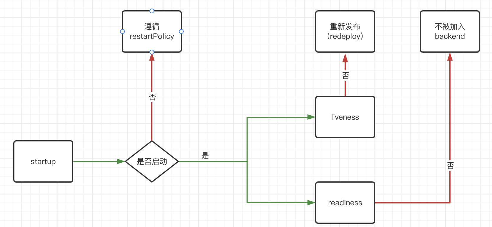

# 3.5. 为 Container 添加健康检查方法

> 大家好， 我是老麦。
> kustz 终于到了准生产的地步了。 今天的健康检查接口， 就为我们解决这个问题。


我们要知道， 确定一个应用能不能对外提供服务之前， 需要进行一个 **可用性** 检测。 而这个检测通常被我们称为 **健康检查**。


## Kubernetes 的健康检查

在 Kubernetes 中， 为我们提供了 **主要** 的 **3类状态** 的健康检查。

1. startup: 等待探针。 如果执行成功， 则再执行 liveness, readienss。 如果执行失败， 则遵循 `restartPolicy` 规则。
2. liveness: 存活探针， 如果失败， 服务将被重新发布(redeploy)。
3. readiness: 就绪探针， 如果失败， 服务不会加入到 **service backend endpoints** 中对外提供服务。

> https://kubebyexample.com/learning-paths/application-development-kubernetes/lesson-4-customize-deployments-application-2



此外， Kubernetes 支持 **4种类型** 的检查方式

1. httpGet: 检查 GET 接口返回值。
2. tcp: tcp 端口是否打开。
3. exec: 命令执行是否成功。
4. grpc: grpc 端口是否打开。

## `kustz.yml` 配置

一如既往， 我们需要抽象一个简单明了的方法定义健康检查方法。 剩下的就交给 kustz 处理。

```yaml
# kustz.yml

service:
  probes:
    liveness:
      action: http://:8080/healthy
      headers:
        token: "token123"
      initialDelaySeconds: 30 
    readiness:
      action: tcp://0.0.0.0:8080
    startup:
      action: cat /tmp/healthy
```

从配置中可以看到， 通过 action 我们提供了其中三种检查方法 `httpGet, tcp, exec`。

> grpc 现在还属于 1.24 还 beta 状态。 对于 grpc 我也不熟， 所以就不讨论了。


## 编码

这节不难

### 数据结构定义

对应的在 `/pkg/kustz/kustz.go` 中添加如下结构。

```go
type Service struct {
	Probes    ContainerProbes   `json:"probes,omitempty"`
}


type ContainerProbe struct {
	ProbeHandler                  `json:",inline"`
	InitialDelaySeconds           int32  `json:"initialDelaySeconds,omitempty"`
	TimeoutSeconds                int32  `json:"timeoutSeconds,omitempty"`
	PeriodSeconds                 int32  `json:"periodSeconds,omitempty"`
	SuccessThreshold              int32  `json:"successThreshold,omitempty"`
	FailureThreshold              int32  `json:"failureThreshold,omitempty"`
	TerminationGracePeriodSeconds *int64 `json:"terminationGracePeriodSeconds,omitempty"`
}

```

其中 `ContainerProbe` 基本上就是从 `corev1.Probe` 中直接复制过来的， 但又对 `ProbeHandler` 进行了一些本地化处理。

```go
type ProbeHandler struct {
	Action  string            `json:"action,omitempty"`
	Headers map[string]string `json:"headers,omitempty"`
}
```

### 处理 Action 生成 Handler

对于 `Action` 的值， 我们需要进行类型处理， 并返回相应的 `corev1.ProbeHandler`。

在 `/pkg/tokube/container_probe.go` 中, 定义函数 `ProbeHandler` 处理 `action` 和 `headers` 的值并返回结果。

```go
// ProbeHandler action
//
// http(s)://:8080/healthy
// tcp://:8080
// cat /tmp/healthy
func ProbeHandler(action string, headers map[string]string) corev1.ProbeHandler {
	if strings.HasPrefix(action, "tcp://") {
		return toTCPProbeHandler(action)
	}

	if strings.HasPrefix(action, "http://") || strings.HasSuffix(action, "https://") {
		return toHTTPProbeHandler(action, headers)
	}

	return toExecProbeHandler(action)
}
```

可以看到， 通过判断 `action` 的前缀字符串的值， 确认了健康检查的方法。 而只有 `httpGet` 方法接受了 headers 参数。

在 `toTCPProbeHandler()` 和 `toHTTPProbeHandler()` 中， 使用 `url.Parse()` 方法， 很简单的提取了所有字段数据。

在 `toExecProbeHandler` 中， 直接使用 `strings.Split()` 方法分割。


### 为 Container 添加健康检查

在 `/pkg/kustz/k_container.go` 中， 为 `ContainerProbe` 为添加方法 `kubeProbe` 创建健康检查， 这时添加所有附加参数。

```go
// kubeProbe return Kube Probe without handler
func (cp *ContainerProbe) kubeProbe() *corev1.Probe {
	handler := tokube.ProbeHandler(cp.Action, cp.Headers)
	return &corev1.Probe{
		ProbeHandler:                  handler,
		InitialDelaySeconds:           cp.InitialDelaySeconds,
		TimeoutSeconds:                cp.TimeoutSeconds,
		PeriodSeconds:                 cp.PeriodSeconds,
		SuccessThreshold:              cp.SuccessThreshold,
		FailureThreshold:              cp.FailureThreshold,
		TerminationGracePeriodSeconds: cp.TerminationGracePeriodSeconds,
	}
}
```

为 `ContainerProbes` 添加 `kubeProbe` 方法， 解决 `ContainerProbe` 的为 nil 的问题。

```go
func (cps ContainerProbes) kubeProbe(cp *ContainerProbe) *corev1.Probe {
	if cp == nil {
		return nil
	}
	return cp.kubeProbe()
}
```

## 测试 

执行命令， 检查结果

```bash
$ make test.deployment
```
